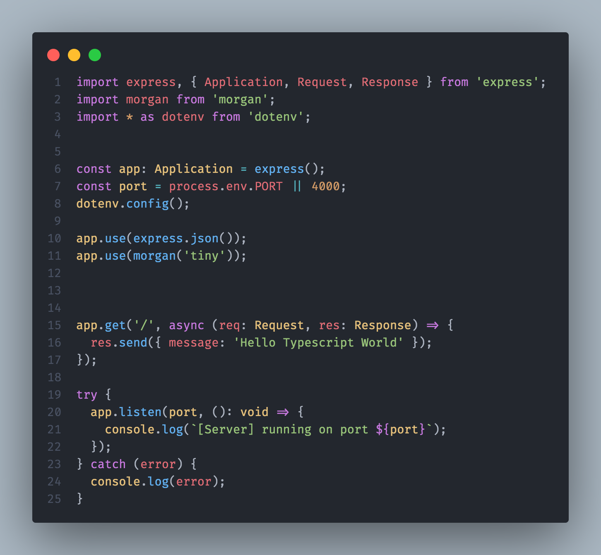

# Express + Typescript Boilerplate

A clean boilerplate with Express + Typescript + Nodemon + Morgan + Dotenv.

## Screenshots



## Run Locally

Clone the project

```bash
  git clone https://github.com/nicholasherious/ts-node-boilerplate.git
```

Go to the project directory

```bash
  cd my-project
```

Install dependencies

```bash
  npm install
```

Start the server

```bash
  npm run start or npm run dev
```

## Authors

- [@nicholasherious](https://www.github.com/nicholasherious)

## Feedback

If you have any feedback, please reach out to us at nherious@gmail.com
